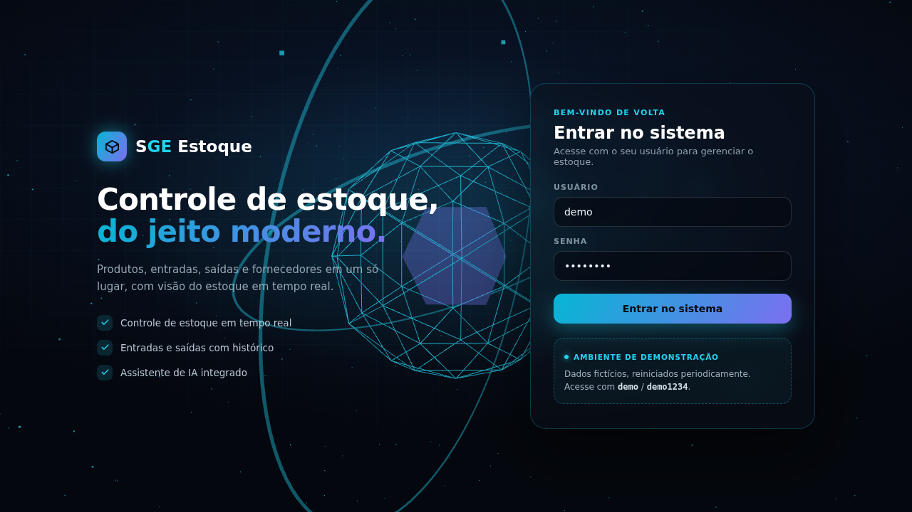

<div align="center">
  

  <h1>SGE — Sistema de Gestão de Estoque</h1>
  <p><strong>Controle de estoque</strong> — produtos, categorias, fornecedores, entradas e saídas, dashboard com métricas e um assistente de IA.</p>

  <p><a href="https://frontend-vert-seven-86.vercel.app/"><strong>🔗 Ver demo ao vivo</strong></a></p>
  <p><sub>Demo: usuário <code>demo</code> · senha <code>demo1234</code></sub></p>

  <p>
    
    
    
    
    
    
    
    
    
  </p>
</div>

A Django-based **Inventory Management System** (SGE - *Sistema de Gestão de Estoque*) that allows you to manage products, suppliers, and stock movements (inflows/outflows), providing a dashboard with metrics and charts. It also includes an optional **AI insights** module to generate short daily inventory/sales recommendations based on system data.

## 🚀 Live Demo

A public demo instance runs on **Vercel** (Python serverless / WSGI), backed by a **Postgres** database on **Neon**:

**URL:** https://sge-demo-puce.vercel.app

**Login:**
- Usuário: `demo`
- Senha: `demo1234`

The `demo` account is not staff/superuser — it only has view/add/change/delete permissions on the main modules (products, categories, brands, suppliers) and view/add on inflows/outflows. It cannot access `/admin/`, create other users, or change passwords (blocked by `DemoModeMiddleware` while `DEMO_MODE=True`).

### Resetting the demo data

All data (products, brands, categories, suppliers, inflows/outflows) is fictional. It can be reset back to the original seeded dataset at any time:

```bash
curl -X POST -H "X-Reset-Token: <RESET_TOKEN>" https://sge-demo-puce.vercel.app/api/reset-demo/
```

`RESET_TOKEN` is stored only as a Vercel environment variable and is not published here. Resetting invalidates active `demo` sessions (the password hash is reset), so a fresh login is required afterwards. Resets are currently manual/on-demand — there is no automated schedule configured yet; wiring one up (e.g. Vercel Cron or a GitHub Action hitting the endpoint) is a natural next step if fully unattended periodic resets are wanted.

Locally, the same effect can be achieved with:

```bash
python manage.py reset_demo
```

### Serverless limitations

Running Django on Vercel's Python serverless runtime introduces a few constraints compared to a normal always-on server:

- **No background jobs / scheduler**: the original crontab-based task (`fazer_coisas`) was removed; nothing runs on a fixed schedule, and there's no Celery/queue worker.
- **SQLite is dev-only**: each serverless invocation is stateless and ephemeral, so production uses Postgres (Neon) via `DATABASE_URL`; `db.sqlite3` remains the default only for local development (no `DATABASE_URL` set).
- **Static files are pre-collected and committed**: there is no custom build step to run `collectstatic` on Vercel's build, so `staticfiles/` is generated locally (`python manage.py collectstatic`) and committed to the repo; it's served in-process by **WhiteNoise**.
- **Cold starts**: the first request after a period of inactivity can take a few seconds longer.
- **Real-time webhook notification disabled**: the synchronous call to the companion `03-Webhooks-Inventory-Management-System` project (previously fired on every outflow, pointed at `http://localhost:8001`) is disabled in `outflows/signals.py` for this deployment, since that service isn't reachable from Vercel's serverless functions.
- **Migrations run manually**: Vercel's build only installs Python dependencies (`pip install -r requirements.txt`); `python manage.py migrate` must be run locally (or via a separate job/CI step) against the production database — it does not run automatically on deploy.

## Documentation

Full project documentation is available at:
<a href="https://gabrieldlobo.github.io/02-Inventory-Management-System/" target="_blank" rel="noopener noreferrer">https://gabrieldlobo.github.io/02-Inventory-Management-System/</a>

### Local preview

```bash
mkdocs serve -a 127.0.0.1:8001
```

Open:
<a href="http://127.0.0.1:8001/" target="_blank" rel="noopener noreferrer">http://127.0.0.1:8001/</a>

### Docs source

Edit markdown pages in `docs/` and navigation in `mkdocs.yml`.

### Publish

```bash
mkdocs gh-deploy --clean
```

## Key Features

- **Authentication**
  - Login/Logout pages
  - Permission-based access to modules and dashboard sections

- **Inventory domain modules**
  - Suppliers
  - Brands
  - Categories
  - Products

- **Stock movements**
  - **Inflows**: register incoming stock (purchases/entries)
  - **Outflows**: register outgoing stock (sales/dispatch)

- **Dashboard**
  - Inventory metrics
  - Sales metrics
  - Charts and daily aggregations

- **AI Insights (optional)**
  - Uses OpenAI to generate short, direct insights about replenishment and sales/outflows
  - Stores generated insights and shows them in the dashboard

## Tech Stack

- Python / Django
- Django Templates (HTML)
- TailwindCSS (via CDN)
- (Optional) OpenAI API

## Project Structure (high-level)

Common Django apps you may find in this repository:

- `app/` — Django project configuration (settings/urls) and dashboard views
- `products/`, `categories/`, `brands/`, `suppliers/` — master data
- `inflows/`, `outflows/` — stock movements
- `authentication/` — API/auth related endpoints (mounted under `/api/v1/`)
- `ai/` — AI prompts + agent logic that produces inventory insights

## Main Routes (typical)

- `GET /login/` — Login
- `POST /login/` — Login submit
- `GET /logout/` — Logout
- `GET /home/` — Dashboard
- `/api/v1/` — API (authentication module)

> Other routes depend on each module (`products`, `inflows`, `outflows`, etc.).

## Getting Started (development)

### 1) Clone and create a virtual environment

```bash
git clone https://github.com/GabrielDLobo/02-Inventory-Management-System.git
cd 02-Inventory-Management-System

python -m venv venv
# Linux/Mac:
source venv/bin/activate
# Windows:
# venv\Scripts\activate
```

### 2) Install dependencies

If the repository has a `requirements.txt`:

```bash
pip install -r requirements.txt
```

If not, install the minimum:

```bash
pip install django python-decouple
```

### 3) Configure environment variables

Create a `.env` file if your settings expect it. For AI features, set:

- `OPENAI_API_KEY`
- `OPENAI_MODEL` (e.g. `gpt-4o-mini`)

If you don't want AI features, you can keep them unset and disable the related execution in your environment.

### 4) Run migrations and create an admin user

```bash
python manage.py migrate
python manage.py createsuperuser
```

### 5) Run the server

```bash
python manage.py runserver
```

Open: http://127.0.0.1:8000/

## How this project complements the Webhooks project

This repository is the **core system** where stock and sales are recorded.  
The companion repository **03-Webhooks-Inventory-Management-System** can be used as an **integration/notification service** to receive events (like a new sale/outflow) and send notifications (email + messaging).

A common setup is:
1. A sale is created in this system (or in another system).
2. An event is posted to the Webhooks service.
3. Notifications are sent to administrators or stakeholders.

> **Note:** this integration is disabled in the [Live Demo](#-live-demo) deployed on Vercel, since the Webhooks service isn't reachable from that serverless environment. Re-enable it in `outflows/signals.py` if you deploy both services together.

## License

No license file is included by default. Add a license if you plan to distribute or use this project commercially.

## Segurança & Qualidade

- **[Relatório de QA](docs/QA_REPORT.md)** — cobertura de testes, verificações manuais e itens conhecidos.
- **[Segurança da autenticação](docs/authentication-security.md)** — modelo de permissões do usuário `demo`, JWT, lockout por IP (django-axes) e `DEMO_MODE`.

# Project Images

## Login


## Home


## Suppliers / Fornecedores 


## Brands / Marcas


## Categories / Categorias


## Products / Produtos


## Inflows / Entradas


## Outflows / Saídas

