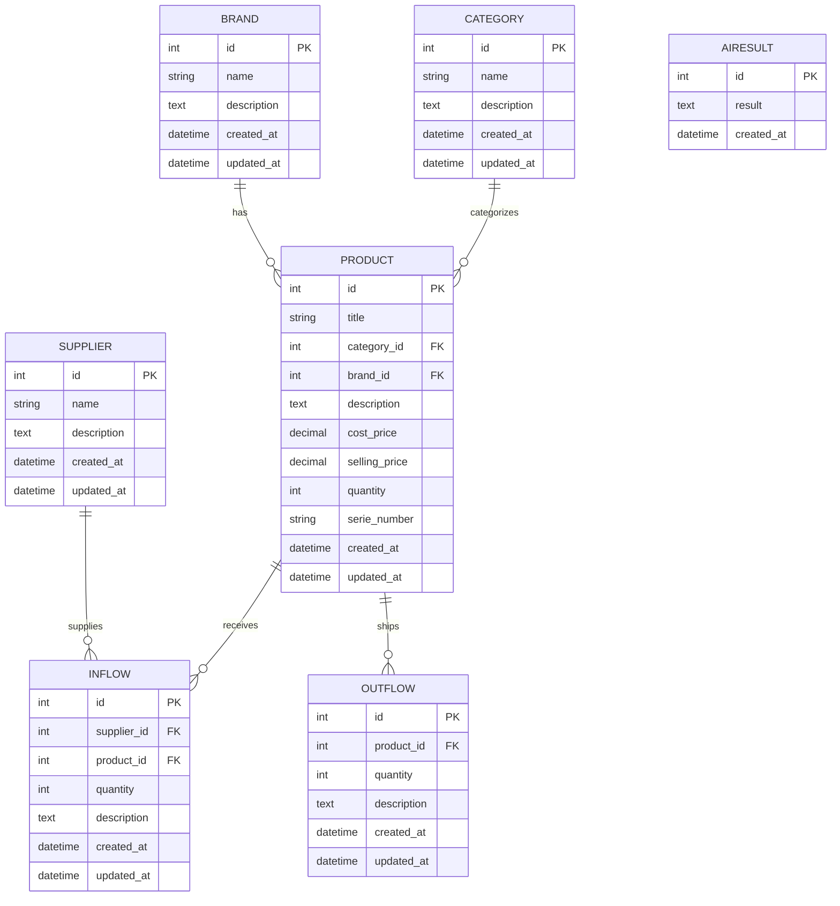
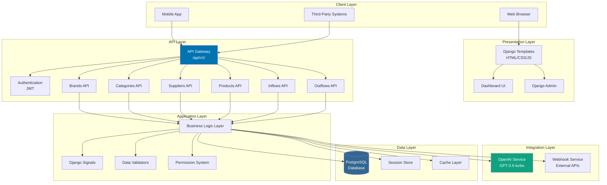
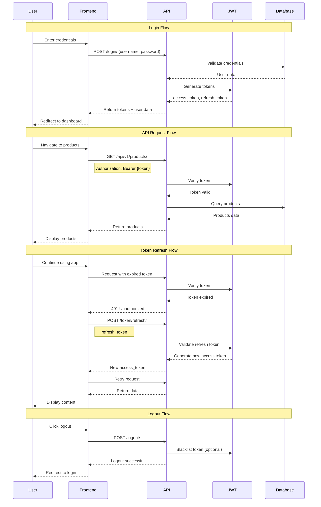
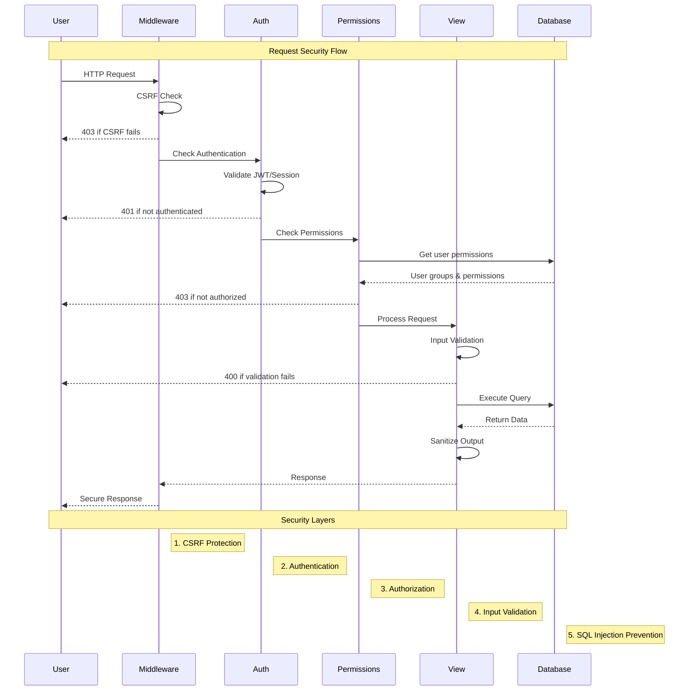
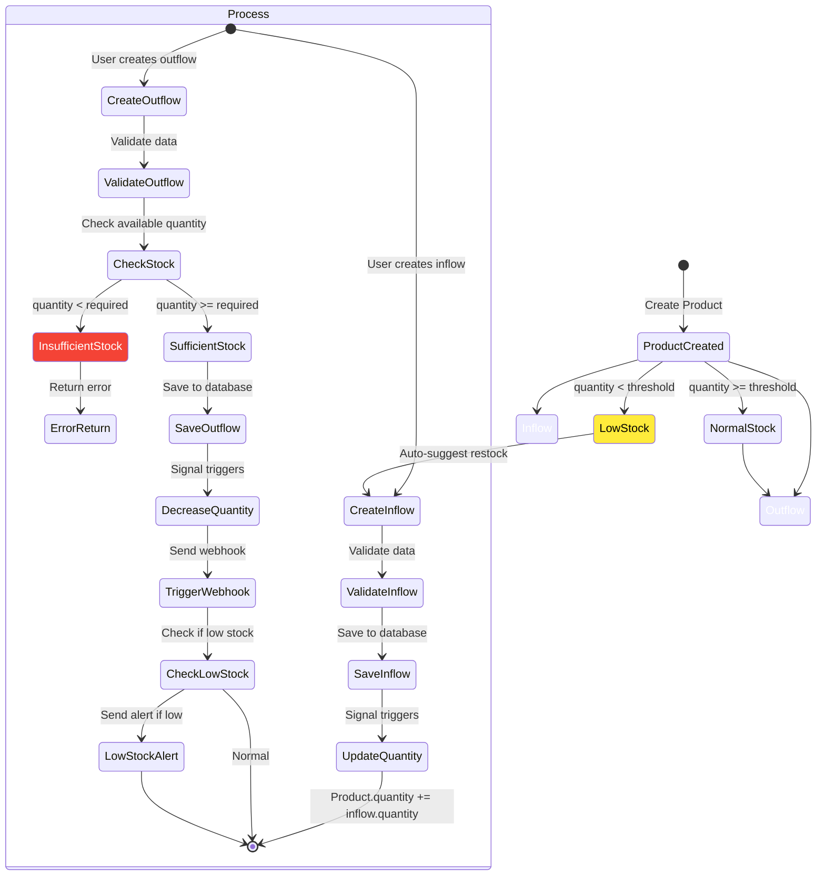
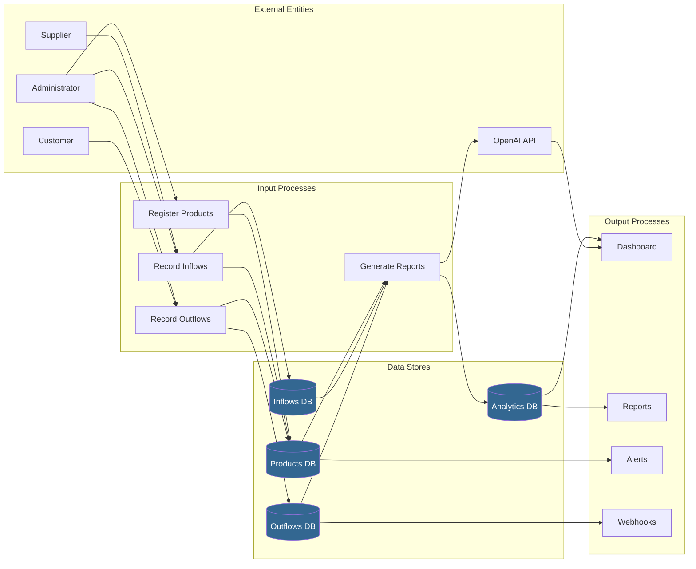

# System Modeling

This document provides comprehensive system modeling diagrams including ERD, architecture, and flow diagrams.

## Table of Contents

- [System Modeling](#system-modeling)
  - [Table of Contents](#table-of-contents)
  - [Entity Relationship Diagram (ERD)](#entity-relationship-diagram-erd)
    - [Relationship Details](#relationship-details)
    - [Constraints](#constraints)
  - [System Architecture](#system-architecture)
    - [Architecture Layers](#architecture-layers)
  - [Authentication Flow](#authentication-flow)
    - [Authentication Components](#authentication-components)
  - [CRUD Operations Flow](#crud-operations-flow)
    - [CRUD Permissions Matrix](#crud-permissions-matrix)
  - [Security Flow](#security-flow)
    - [Security Layers](#security-layers)
  - [Stock Movement Flow](#stock-movement-flow)
    - [Stock Movement Rules](#stock-movement-rules)
  - [Data Flow Diagram](#data-flow-diagram)
  - [Sequence Diagram: Complete Order Flow](#sequence-diagram-complete-order-flow)

---

## Entity Relationship Diagram (ERD)



### Relationship Details

| Relationship | Type | Description |
|--------------|------|-------------|
| Brand → Product | 1:N | One brand can have many products |
| Category → Product | 1:N | One category can have many products |
| Supplier → Inflow | 1:N | One supplier can have many inflows |
| Product → Inflow | 1:N | One product can have many inflows |
| Product → Outflow | 1:N | One product can have many outflows |

### Constraints

- **PROTECT** on all foreign keys: Prevents deletion of referenced records
- **NOT NULL** on required fields: title, name, quantity, prices
- **UNIQUE** on serie_number (when provided)

---

## System Architecture



### Architecture Layers

| Layer | Components | Responsibility |
|-------|------------|----------------|
| **Client** | Browser, Mobile, Third-party | User interaction |
| **Presentation** | Templates, Dashboard, Admin | UI rendering |
| **API** | REST endpoints, JWT auth | External access |
| **Application** | Business logic, Signals | Core functionality |
| **Integration** | OpenAI, Webhooks | External services |
| **Data** | PostgreSQL, Cache | Data persistence |

---

## Authentication Flow



### Authentication Components

| Component | Purpose |
|-----------|---------|
| **JWT Access Token** | Short-lived token (1 day) for API access |
| **JWT Refresh Token** | Long-lived token (7 days) for renewal |
| **Session Auth** | Django session for web interface |
| **Permission System** | Model-level permissions |

---

## CRUD Operations Flow

```mermaid
graph TD
    subgraph Create Operations
        StartCreate[Start Create] --> ValidateCreate[Validate Data]
        ValidateCreate --> CheckPermissions[Check Create Permission]
        CheckPermissions --> SaveData[Save to Database]
        SaveData --> TriggerSignals[Trigger Signals]
        TriggerSignals --> ReturnCreate[Return Created Object]
    end
    
    subgraph Read Operations
        StartRead[Start Read] --> CheckReadPerms[Check View Permission]
        CheckReadPerms --> QueryData[Query Database]
        QueryData --> ApplyFilters[Apply Filters/Sorting]
        ApplyFilters --> Paginate[Paginate Results]
        Paginate --> ReturnRead[Return Data]
    end
    
    subgraph Update Operations
        StartUpdate[Start Update] --> ValidateUpdate[Validate Data]
        ValidateUpdate --> CheckUpdatePerms[Check Change Permission]
        CheckUpdatePerms --> GetObject[Get Object]
        GetObject --> UpdateFields[Update Fields]
        UpdateFields --> SaveUpdate[Save Changes]
        SaveUpdate --> ReturnUpdate[Return Updated Object]
    end
    
    subgraph Delete Operations
        StartDelete[Start Delete] --> CheckDeletePerms[Check Delete Permission]
        CheckDeletePerms --> CheckRelations[Check Related Objects]
        CheckRelations -->|Has Relations| BlockDelete[Block - PROTECT]
        CheckRelations -->|No Relations| DeleteObject[Delete Object]
        DeleteObject --> ReturnDelete[Return 204 No Content]
    end
    
    style StartCreate fill:#4CAF50,color:#fff
    style StartRead fill:#2196F3,color:#fff
    style StartUpdate fill:#FF9800,color:#fff
    style StartDelete fill:#f44336,color:#fff
    style BlockDelete fill:#f44336,color:#fff
```



### CRUD Permissions Matrix

| Operation | Permission Required | View |
|-----------|---------------------|------|
| **Create** | `add_<model>` | Admin, Managers |
| **Read** | `view_<model>` | All authenticated users |
| **Update** | `change_<model>` | Admin, Managers |
| **Delete** | `delete_<model>` | Admin only |

---

## Security Flow



### Security Layers

| Layer | Protection | Implementation |
|-------|------------|----------------|
| **CSRF** | Cross-site request forgery | Django CSRF middleware |
| **Authentication** | Unauthorized access | JWT + Session auth |
| **Authorization** | Permission-based access | Django permissions |
| **Input Validation** | Malicious input | Forms + Serializers |
| **SQL Injection** | Database attacks | Django ORM |
| **XSS** | Script injection | Template auto-escaping |

---

## Stock Movement Flow



### Stock Movement Rules

| Movement | Effect | Trigger |
|----------|--------|---------|
| **Inflow Create** | quantity += inflow.quantity | post_save signal |
| **Outflow Create** | quantity -= outflow.quantity | post_save signal |
| **Outflow Check** | Validate quantity >= 0 | pre_save validation |
| **Low Stock Alert** | Notify if quantity < threshold | post_save signal |

---

## Data Flow Diagram



---

## Sequence Diagram: Complete Order Flow

```mermaid
sequenceDiagram
    participant A as Admin
    participant S as System
    participant P as Product
    participant I as Inflow
    participant O as Outflow
    participant W as Webhook
    participant AI as AI Service
    
    Note over A,AI: Product Lifecycle
    
    A->>S: Create Brand/Category/Supplier
    S-->>A: Confirm creation
    
    A->>S: Create Product
    S->>P: Save product (qty=0)
    S-->>A: Product created
    
    A->>S: Create Inflow (qty=100)
    S->>I: Save inflow record
    I->>P: Update quantity (0+100=100)
    S-->>A: Inflow recorded
    
    Note over A,AI: Sales Process
    
    A->>S: Create Outflow (qty=20)
    S->>O: Validate stock (100 >= 20)
    O->>P: Update quantity (100-20=80)
    O->>W: Send webhook event
    W-->>O: Webhook acknowledged
    
    S->>P: Check stock level
    P-->>S: Stock OK (80 > threshold)
    S-->>A: Outflow recorded
    
    Note over A,AI: Low Stock Scenario
    
    A->>S: Create Outflow (qty=70)
    S->>O: Validate stock (80 >= 70)
    O->>P: Update quantity (80-70=10)
    O->>W: Send webhook event
    
    S->>P: Check stock level
    P-->>S: LOW STOCK (10 < threshold)
    S->>AI: Request analysis
    AI-->>S: Generate insights
    S->>A: Send low stock alert
    S-->>A: Suggest restock
    
    style P fill:#4CAF50,color:#fff
    style I fill:#2196F3,color:#fff
    style O fill:#FF9800,color:#fff
    style W fill:#9C27B0,color:#fff
    style AI fill:#10a37f,color:#fff
```

---

**Next Steps**: 
- [Authentication & Security](authentication-security.md) - Detailed security documentation
- [Development](development.md) - Development workflow
